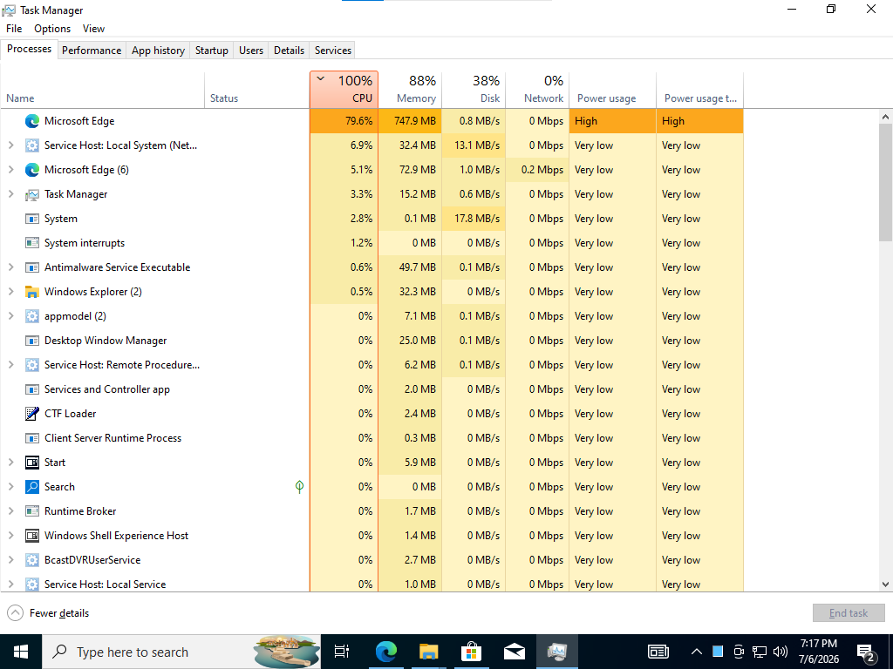
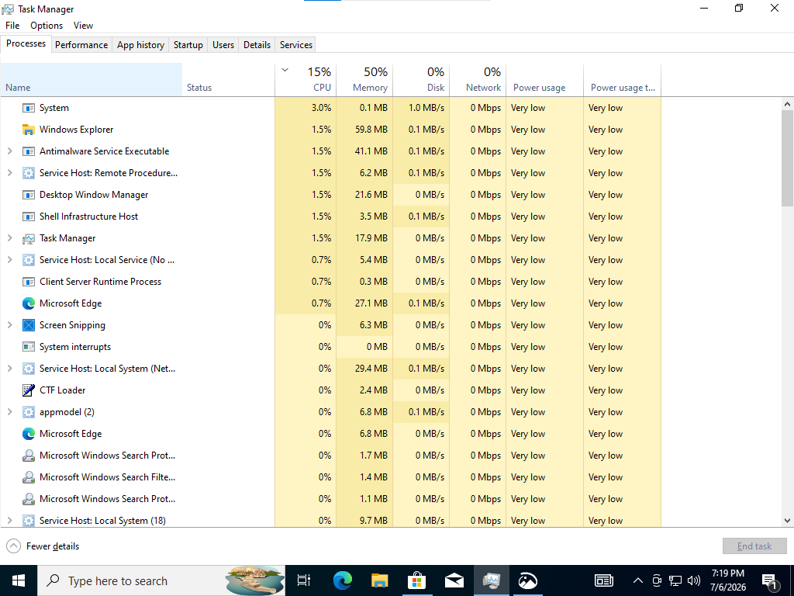

# Lab 1 – Slow Computer Troubleshooting (Windows 10)

##  Objective
Simulate and troubleshoot a slow Windows 10 PC using real IT Service Desk methodology — investigate before fixing, gather evidence, identify root cause, apply the least risky fix, and document the resolution professionally.

##  Lab Environment
- **Platform:** VirtualBox
- **OS:** Windows 10
- **RAM:** 2 GB
- **CPU:** 1 Core

##  Problem Simulation
To recreate a real-world slow PC scenario, the following load was created on the VM:
- Opened 10–15 Notepad windows
- Opened 5 File Explorer windows
- Opened Paint 3–4 times
- Opened Microsoft Edge with 8–10 tabs
- Left the system running for 2–3 minutes to build up resource load

##  User Complaint (Simulated)
> "My computer is very slow. Everything takes a long time to open."

---

## Step 1 – Understanding the Issue (Diagnostic Questions)
Before touching the system, diagnostic questions were asked to the (simulated) user:

1. When did you first notice this slowness?
2. Is it slow all the time, or only at certain times?
3. Did you install any new software or updates recently?
4. Have you restarted your PC recently?

**Simulated user response:**
> "It started today morning. It's slow all the time now, even opening Notepad takes time. I didn't install anything new. I haven't restarted in 3 days."

This ruled out software updates/installs as the cause and pointed toward a resource overload scenario.

---

## Step 2 – Gathering Evidence (Task Manager – Performance Tab)

| Resource | Reading (Before Fix) |
|---|---|
| CPU | 100% |
| Memory | 88% |
| Disk | 38% |
| Network | 0% |

 **Screenshot – Before Fix (High Resource Usage):**

---

## Step 3 – Identifying the Top Resource Consumers

Sorted Task Manager's Processes tab by CPU and Memory:

| Process | CPU % | Memory |
|---|---|---|
| Microsoft Edge | 79.6% | 747.9 MB |
| Service Host: Local System (Net...) | 6.9% | 32.4 MB |
| Microsoft Edge (6) | 5.1% | 72.9 MB |

**Observation:** Microsoft Edge was the single largest consumer of both CPU and Memory — each browser tab runs as its own process, so 8–10 tabs quickly consumed a large share of the system's limited 2GB RAM.

---

## Step 4 – Root Cause Analysis

**Root Cause:**
System resources (CPU and RAM) were overloaded due to too many applications running simultaneously on a low-spec machine (2GB RAM, 1 CPU core). Microsoft Edge, with multiple open tabs, was the primary contributor to high CPU and memory usage.

**Note on Disk Usage:** The 38% Disk usage was not an independent cause — it was a side-effect of Windows using virtual memory (paging to disk) to compensate for insufficient RAM.

---

## Step 5 – Choosing the Fix (Risk-Based Decision)

Four possible fixes were evaluated and ranked from least risky to most risky:

| Rank | Option | Reasoning |
|---|---|---|
| 1 | **Close unnecessary Edge tabs/apps** | Fixes the issue immediately with minimal disruption; user can save work first |
| 2 | Restart the PC | Would work, but risks loss of unsaved user data |
| 3 | Upgrade RAM | Valid long-term fix, but not an immediate solution — logged as a recommendation |
| 4 | Reinstall Windows | Far too extreme; no evidence of OS corruption or malware |

**Fix Applied:** Closed excess Notepad windows, File Explorer windows, and unnecessary Microsoft Edge tabs.

---

## Step 6 – Verifying the Fix

📸 **Screenshot – After Fix (Resources Stabilized):**

| Resource | Before | After |
|---|---|---|
| CPU | 100% | 15% |
| Memory | 88% | 50% |
| Disk | 38% | 0% |

System was monitored for a few minutes after the fix to confirm the improvement was stable and not temporary, before considering the issue resolved.

---

## Step 7 – Ticket Documentation (Real Service Desk Format)

**Ticket #:** INC001234
**Issue Reported:** User reported the computer was running very slow, with applications taking a long time to open.

**Investigation/Findings:**
- Checked Task Manager → Performance tab
- CPU usage: 100%, Memory usage: 88%, Disk usage: 38%
- Sorted Processes tab by CPU and Memory
- Found Microsoft Edge consuming 79.6% CPU and 747.9 MB memory across multiple tab processes
- Multiple other applications (10–15 Notepad, 5 File Explorer, Paint) were open simultaneously

**Root Cause:**
System resource overload (CPU + RAM) caused by too many open applications on a low-spec machine (2GB RAM, 1 core). Microsoft Edge with multiple tabs was the primary contributor. High Disk usage was a side-effect of RAM shortage (paging), not an independent issue.

**Resolution:**
Closed unnecessary Microsoft Edge tabs, Notepad windows, and File Explorer windows. Monitored system for a few minutes post-fix to confirm stability.
- CPU: 100% → 15%
- Memory: 88% → 50%
- Disk: 38% → 0%

**Recommendation:**
Advise user to limit the number of simultaneously open browser tabs and applications, especially on systems with limited RAM. If slowness recurs frequently, recommend a RAM upgrade, as 2GB is below the recommended minimum for smooth Windows 10 performance.

**Status:** ✅ Resolved

---

##  Key Learnings from This Lab
- Always **investigate before fixing** — jumping to a solution without evidence is a common mistake.
- Check **CPU, Memory, and Disk together** — a high reading in one resource doesn't tell the full story.
- High Disk usage can be a **symptom of low RAM (paging)**, not always a disk problem itself.
- Always choose the **least risky fix first** — closing specific apps is safer than restarting or reinstalling.
- **Verify the fix is stable** before closing a ticket — prevents ticket reopens.
- Clear, structured **ticket documentation** (Issue → Investigation → Root Cause → Resolution → Recommendation) is a critical professional skill.

---

*This lab was completed as part of hands-on IT Service Desk training, simulating a real troubleshooting scenario from user complaint to ticket closure.*
