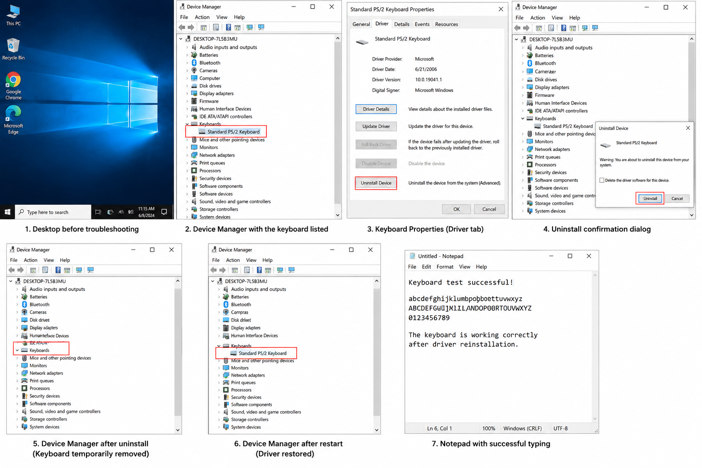

# Lab 3 – Keyboard Not Working (Peripheral / Driver Troubleshooting)

> **Lab Type:** Hands-On (VirtualBox)
> This issue was recreated inside a Windows 10 VM by uninstalling the keyboard driver, simulating a real-world "keyboard stopped working" support ticket, then resolved using standard Device Manager troubleshooting.

---

##  Quick Summary

| | |
|---|---|
| **Issue Type** | Peripheral / Driver |
| **Reported By** | User (simulated) |
| **Symptom** | Keyboard completely unresponsive — no input registers in any application |
| **Root Cause** | Keyboard driver was missing/uninstalled, so Windows could not communicate with the device |
| **Fix** | Restarted PC → Windows automatically reinstalled the driver |
| **Status** |  Resolved |

##  Skills Practiced
- Device Manager Navigation & Driver Management
- Peripheral / Input Device Troubleshooting
- Windows Driver Reinstallation
- Root Cause Analysis (RCA)
- Structured Diagnostic Questioning
- Mouse-Only Navigation (working around a dead input device)
- Incident Documentation & Ticket Writing

---

##  Step 1: User Complaint

> "My keyboard suddenly stopped working. I can't type anything, even in Notepad or the search bar."

### Diagnostic Questions Asked
1. Is your keyboard wired or wireless?
2. Could you try connecting it to a different USB port, or try it on another PC/laptop?
3. Did this happen suddenly, or has it been intermittent?
4. When you press Caps Lock or Num Lock, does the indicator light turn on?
5. Have there been any recent Windows updates or driver changes?

### Simulated User Response
> "It's a wired USB keyboard. I tried another USB port, still not working. It happened suddenly today. When I press Caps Lock, no light turns on at all. No updates that I know of."

** Key Clues:**
- No lights respond at all → points toward a driver/detection issue rather than a physical fault
- Tried a different port with no change → rules out a faulty USB port

---

##  Step 2: Reproducing the Issue (Lab Simulation)

To safely recreate this exact scenario inside the VM:

1. Opened **Device Manager**
2. Expanded **Keyboards**
3. Right-clicked the keyboard device → **Uninstall device** (the "Disable device" option was not available for this driver, so Uninstall was used instead)
4. Restarted Windows

**Result:** Keyboard stopped responding entirely after the uninstall — confirming the simulated symptom matched the reported issue (no input, no lights).

 **Full Troubleshooting Evidence (Desktop → Device Manager → Uninstall → Restart → Verified Fix):**

---

##  Step 3: Navigating Windows Without a Keyboard

Once the keyboard driver was uninstalled, the keyboard became completely unresponsive — which meant Device Manager had to be reopened **using the mouse only**. This is a genuinely useful real-world skill, since a support engineer often has to guide a user (or work on their own machine) when the very input device needed for troubleshooting is the one that's broken.

**How to open Device Manager with mouse only:**

| Method | Steps |
|---|---|
| **Method 1 (Fastest)** | Right-click the **Start button** (bottom-left Windows icon) → click **Device Manager** from the menu |
| **Method 2** | Left-click **Start** → click **Windows System** folder → click **Control Panel** → click **Device Manager** |
| **Method 3** | Right-click **Start** → click **Run** → click inside the box → right-click → **Paste** (only works if `devmgmt.msc` was copied beforehand) |

** Why this matters:** In a real support scenario, if a user's keyboard fails completely, you can still guide them (or a remote session) entirely through mouse clicks — Method 1 needs zero typing and works on every version of Windows 10. This is a small but genuinely practical trick worth remembering for real desk-side or remote support calls.

---

##  Step 4: Diagnosis

| Check | Observation |
|---|---|
| Device Manager → Keyboards | Keyboard entry missing / driver not installed |
| Caps Lock / Num Lock lights | No response |
| USB connection | Physically connected, port working (verified with another device) |

**Root Cause:**
The keyboard driver had been removed (uninstalled), so Windows no longer recognized the device at the OS level. This matches a very common real-world scenario where a Windows update, driver corruption, or accidental uninstall leaves the hardware physically fine but functionally invisible to the system.

---

##  Step 5: Fix Applied

1. Restarted the PC (navigated using mouse only, via Method 1 above)
2. Windows automatically detected the missing keyboard driver during restart and reinstalled it
3. Keyboard began responding immediately after login — no manual "Scan for hardware changes" was needed in this case

**Result:** Keyboard fully functional again — verified by typing in Notepad and the Windows search bar.

**Note:** If a simple restart doesn't reinstall the driver automatically, the next step would be: Device Manager → **Action menu → Scan for hardware changes**, which manually triggers Windows to detect and reinstall missing drivers.

---

##  Step 6: Alternative Troubleshooting Methods (Reference)

While a restart resolved this lab, a real Service Desk engineer should know multiple ways to approach a "keyboard not working" ticket, depending on the situation:

| Option | Method | Best Used When |
|---|---|---|
| **Disable/Enable Device** | Device Manager → Disable, then re-enable the keyboard | Quick test to rule out a temporary glitch (not available for all drivers) |
| **Uninstall & Reinstall Driver** | Uninstall device → restart, or Action → Scan for hardware changes | Driver corruption suspected (used in this lab) |
| **HID Service Check** | `services.msc` → check Human Interface Device service is running | USB keyboard not detected at all, deeper driver stack issue |
| **VirtualBox USB Passthrough** | Disconnect/reconnect the USB device in VirtualBox's USB settings | Working inside a VM where the host isn't passing the device through correctly |
| **Physical Port Test** | Move keyboard to a different USB port | Ruling out a faulty port without touching software at all |

** Why this matters:** In a real job, not every keyboard issue has the same root cause. Knowing multiple resolution paths — and which one fits which symptom — is what separates a fresher from a confident engineer during an interview.

---

##  Step 7: Service Desk Ticket Documentation

**Ticket #:** INC001236
**Issue Reported:** User's USB keyboard stopped responding completely — no input in any application, no Caps Lock/Num Lock light response.

**Investigation/Findings:**
- Confirmed USB port was physically fine (tested a different port)
- Checked Device Manager → keyboard driver was missing/uninstalled
- Recreated the issue in a test VM by uninstalling the driver, confirming matching symptoms

**Root Cause:** Keyboard driver was uninstalled/corrupted, causing the OS to no longer detect the device despite it being physically connected.

**Resolution:** Restarted the PC; Windows automatically detected the missing driver and reinstalled it. Keyboard responded immediately after, confirmed working in Notepad and search bar.

**Recommendation:** If this recurs after future updates, recommend checking Device Manager first before assuming hardware failure. If a restart doesn't resolve it, use Action → Scan for hardware changes to manually trigger driver reinstallation.

**Status:**  Resolved

---

##  Key Learnings
- A completely unresponsive keyboard (no lights at all) often points to a **driver/OS-level issue**, not physical damage.
- Not all devices show a "Disable" option in Device Manager — **Uninstall** is a valid alternative for simulating/fixing driver issues.
- A **simple restart** can be enough for Windows to automatically reinstall a missing driver — if not, **Scan for hardware changes** is the manual backup.
- Knowing how to **navigate Windows using mouse only** is a practical skill for when the very device being tested is unavailable.
- Knowing **multiple troubleshooting paths** (disable/enable, uninstall/reinstall, HID service, USB passthrough, port swap) makes diagnosis faster and more accurate.
- Always **rule out physical causes** (port, cable) before assuming it's software — and vice versa.

---

*This lab was completed hands-on inside a Windows 10 VM, simulating a real keyboard driver failure and resolving it using standard Service Desk troubleshooting steps.*
